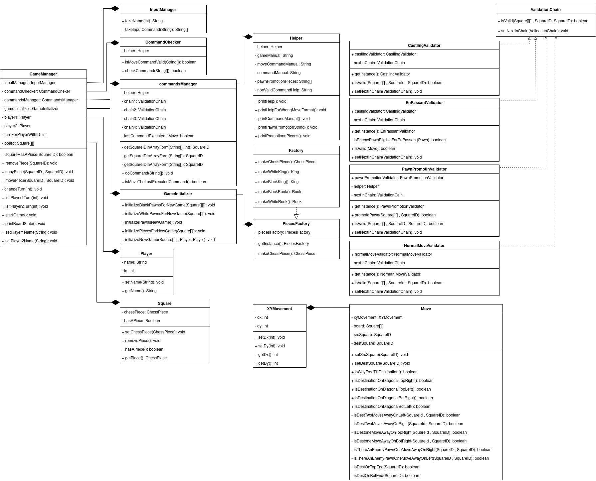
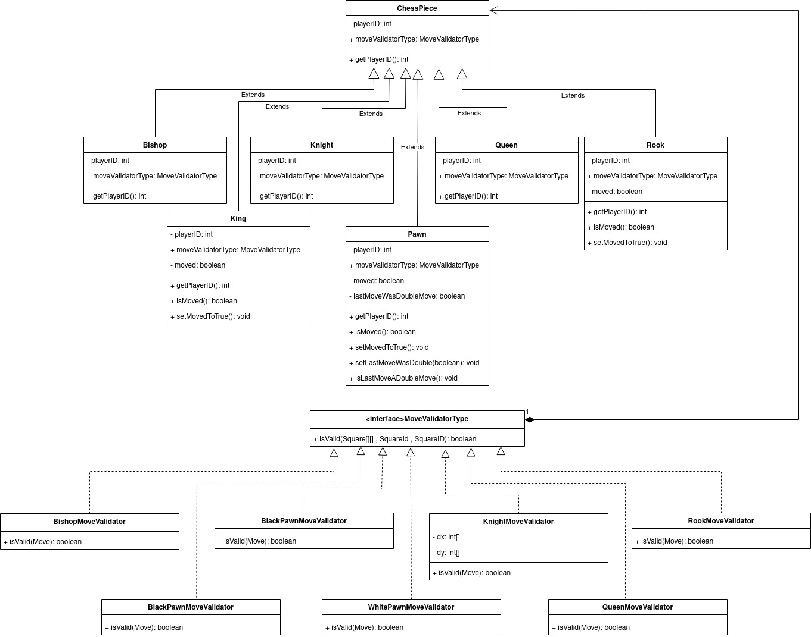
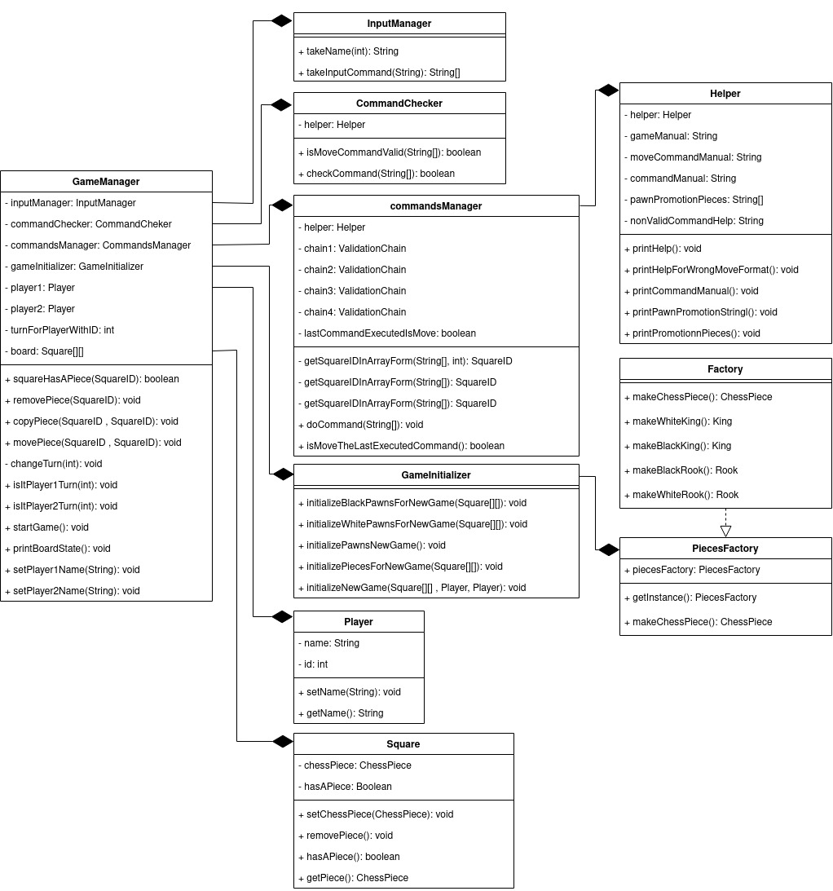
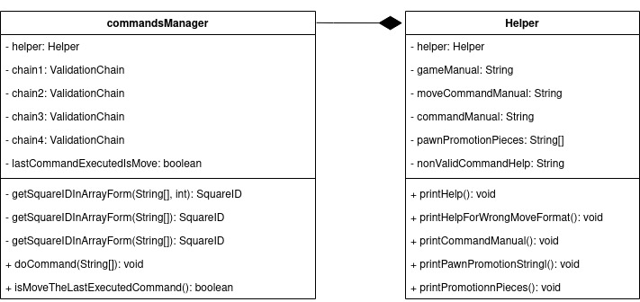
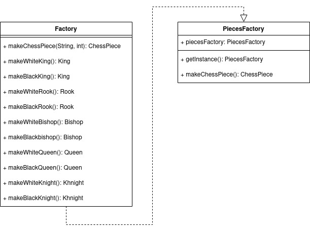
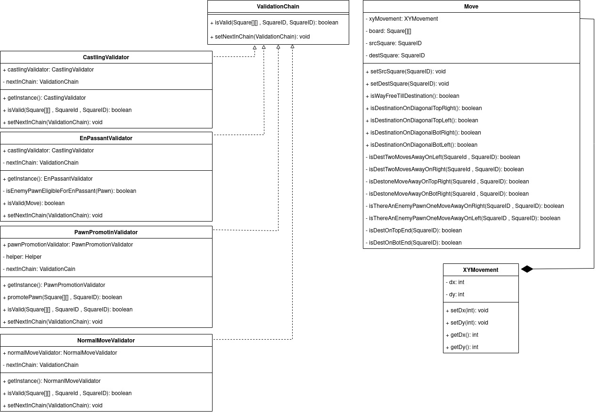

# Chess Game
A chess Game that is playable on terminal and designed and implemented using design patterns, clean code and SOLID principles.

## UML design

## Game Manager

the whole game is abstracted using this class where it.

## CommandsManager and Helper

After taking a command and checking its validity we give it to the command manager to 
execute it where it checks move commands using a chain it also uses the Helper class if
the user entered the help command, the helper is also present in the pawn promotion
 validator to help the user promote his pawns.

## Pieces Factory

I encapsulated the piece making to look cleaner and easier to edit game initialization
 also to add abstraction to make a piece from user input after pawn promotion.

## Move

Move is singleton as only one move can be processed due to chess game nature the move
command is stored this class alongside checking logic for normal movement
validation for each Piece as Queen, Rook and Bishop have some movement behavior in common.

## Validation Chain

Validation is put in a chain for cleaner and more extendable movement checking.

## Pieces

here I used the strategy pattern to encapsulate move checking behavior and make it more 
extendable I had the choice of encapsulating this behavior in the game manager using the 
state pattern to reduce memory use but as I made the Move singleton there is no need and
I think the strategy looks simpler and cleaner.

